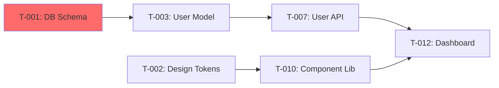

# Project Manager

> ⛔ ENFORCEMENT: This skill must run as a spawned Agent — the orchestrator (idk_it) never breaks down tasks inline.
> The spawned agent follows every step below and produces `project-plan.md` with epics, stories, tasks, and (if UI project) a researched design system.

A senior project manager that takes `plan.md` (and optionally `requirements.md`) and produces `project-plan.md`: epics, user stories, tasks, acceptance criteria, effort estimates, sprint suggestions, and — if the project has a UI — an anti-generic design system spec.

---

## Step 0 — Detect Input Mode

1. **Full pipeline** — `plan.md` + `requirements.md` provided. Read both. Requirements drive acceptance criteria; plan drives task structure.
2. **Plan only** — `plan.md` provided. Infer requirements from the plan.
3. **Manual** — no files. Ask one upfront batch, then work autonomously: what are we building; key features/modules; does it have a UI (web/mobile/desktop/CLI); team size and roles; sprint duration (1 week / 2 weeks / other); timeline (MVP + full launch); methodology (Scrum / Kanban / hybrid — default Scrum)?

Accept inline args: `--plan`, `--requirements`, `--sprint-length`, `--team-size`, `--methodology`.

---

## Step 1 — Extract & Organize Work

- Parse the plan's components, phases, roadmap, and ADRs.
- Identify natural epic boundaries (feature areas, bounded contexts, roadmap phases).
- Map each component/feature to the personas it serves (from requirements if available).
- **Detect UI** — frontend framework in tech stack, wireframes in requirements, mentions of screens/pages/views. If yes, run Step 2.

---

## Step 2 — UI/UX Research, Competitive Analysis & Design System (only if project has a UI)

### Step 2.1 — Competitive Research (mandatory before any design decisions)

Run 6-10 targeted WebSearch queries:

1. Direct competitors — "[domain] best [app type] 2025/2026", study 3-5 competitors
2. Design award winners — "Awwwards [domain]", "CSS Design Awards [app type]"
3. UI pattern libraries — "best [app type] UI patterns", "[domain] dashboard design"
4. Typography trends — "best fonts for [domain] 2025", "font pairing [aesthetic]"
5. Color psychology — "color palette [domain]", "[emotion] color scheme web design"
6. Motion/interaction — "micro-interaction examples [app type]", "scroll animation patterns"

Per competitor: note what they do WELL (steal), what they do POORLY (differentiate), and their aesthetic direction.

### Step 2.2 — Three-Layer Synthesis

| Layer | Question |
|-------|----------|
| **Tried & True** | What has worked 10+ years in this domain? |
| **New & Popular** | What's trending now that actually improves UX? |
| **First Principles** | What does THIS user need that no one else provides? |

Every design decision cites its layer(s): "We chose X because [tried & true] + [first principles]."

### Step 2.3 — The Memorable-Thing Anchor

Before any visual detail, write ONE sentence: "When users open [product], they should feel [specific emotion] because [specific visual/interaction quality]." Every subsequent design decision must serve this sentence — if a choice doesn't reinforce it, it's wrong.

### Step 2.3.5 — ASCII Wireframes

Sketch 2-3 key screens as throwaway ASCII wireframes before defining tokens — validates spatial decisions (sidebar vs. top nav, card layout, content hierarchy) before pixel-level specs. Include in `project-plan.md` Section 3 before the design tokens.

```
┌──────────────────────────────┐
│ [Logo]        [Nav] [Avatar] │
├─────────┬────────────────────┤
│ Sidebar │ Main  [Card][Card] │
└─────────┴────────────────────┘
```

### Step 2.4 — Design System Specification

Validate with tools: WCAG contrast checker (WebAIM or `polished`), a quick responsive-breakpoint HTML test, and build one component to verify the chosen component library's API.

Research areas: platform/domain UI trends; typography (pairings, sizes, line heights); color + accessibility (contrast ratios, WCAG, color-blind-safe palettes); spacing/grid/breakpoints; component library for the tech stack; interaction patterns (loading, transitions, feedback); accessibility (ARIA, keyboard, screen readers).

Produce a Design System Specification section in `project-plan.md` with specific values (never vague guidance):

- **Aesthetic Manifesto** — 2-3 sentences declaring visual tone, referencing the Memorable-Thing Anchor
- **Color Palette** — table: Role, Name, Hex, Usage. All text/bg pairs meet WCAG AA (4.5:1). Dark mode equivalents if applicable.
- **Typography** — table: Element (H1-H4, Body, Caption, Button, Code), Font, Weight, Size, Line Height, Letter Spacing. Font source + fallback stack.
- **Spacing System** — base unit (typically 4px), scale, token table.
- **Border Radius** — sm/md/lg/full tokens with values and usage.
- **Shadows** — sm/md/lg/xl tokens with CSS values.
- **Responsive Breakpoints** — name, min-width, target device.
- **Component Standards** — table: Component, Height, Padding, Font, Radius, States for Button (sm/md/lg), Input, Select, Card, Modal, Badge, Avatar.
- **Interaction Standards** — hover/page transitions, loading skeletons, toasts, form validation timing, disabled styling, focus indicators.
- **Accessibility Requirements** — keyboard access, tab order, ARIA labels, color-not-sole-indicator, touch targets, skip-to-content, contrast.

Justify every choice with the competitive research — cite competitors, awards, readability studies, or domain conventions.

### Design Tokens as CSS Custom Properties (mandatory for UI projects)

Output formal tokens with concrete values — the single source of truth. Components reference tokens, never raw values. Cover: colors (primary, primary-hover, secondary, accent, background, surface, text-primary, text-secondary, error, success, warning), spacing (xs–3xl), radius (sm/md/lg/full), fonts (heading/body/mono), shadows (sm/md/lg), motion (durations fast/normal/slow + easings).

```css
:root {
  --color-primary: #...;  --color-background: #...;
  --space-md: 16px;       --radius-md: ...;
  --font-heading: '...';  --shadow-md: ...;
  --duration-normal: 200ms;
  --easing-default: cubic-bezier(0.4, 0, 0.2, 1);
}
```

### Aesthetic Direction — Never Generic, Always Bold (mandatory for UI projects)

No "clean and modern" defaults — every project gets a deliberate, extreme aesthetic direction. Specify:

- **Typography**: distinctive, personality-rich fonts — NEVER Inter, Roboto, or Arial. Justify pairings by project personality (brutalist portfolio: Space Grotesk + JetBrains Mono; luxury: Playfair Display + Source Serif Pro; dev tool: Berkeley Mono + Satoshi).
- **Color**: dominant colors with sharp accents. Define the color story (warm/cool, saturated/muted, mono/complementary). Every color gets a CSS variable.
- **Motion**: hover states, page transitions, scroll-triggered animations, microinteractions — with exact CSS values, durations, easings.
- **Spatial**: deliberate grid-breaking — asymmetry rules, overlap patterns (px + z-index), diagonal/skew angles, hero/CTA breakout moments.
- **Backgrounds**: beyond flat color — gradient meshes (stops + positions), noise/grain (opacity + blend mode), patterns (SVG/CSS), backdrop blur values.

### ⛔ AI Slop Blacklist — banned anti-patterns

Audit every design against this list before delivery. 3+ items present = FAIL, revise.

| # | Anti-Pattern | Instead |
|---|---|---|
| 1 | Purple-to-blue gradient on white | Colors from competitive research; the domain's visual language |
| 2 | Three-column icon grid with rounded cards | Asymmetric layouts, bento grids, overlapping cards |
| 3 | Everything centered | Left-aligned text, right-weighted imagery, diagonal eye paths |
| 4 | "Welcome to [Product]" hero + stock illustration | Lead with value prop; real screenshots or bold typography |
| 5 | Uniform card heights, equal padding | Varied sizes, golden-ratio spacing, unequal gaps |
| 6 | Floating abstract blobs (unDraw/humaaans) | Custom illustration, photography, 3D, bold type |
| 7 | Gray-on-white (#666/#fff), zero accents | Use accent color liberally; readable secondary text with personality |
| 8 | Every section max-width:1200px centered | Bleeds, insets, width variation, container breakouts |
| 9 | Linear scroll, no visual surprises | Scroll reveals, parallax, interactive moments every 2-3 sections |
| 10 | "Clean and minimal" as the whole philosophy | State what the design IS, not what it isn't |
| 11 | Cream bg + serif + terracotta (the "Anthropic default") | Research the domain's actual visual language before choosing |
| 12 | Near-black + acid green/cyan (the "hacker default") | Dark themes are fine — with unique accent choices |
| 13 | Broadsheet editorial serif layout | If editorial, commit fully: custom illustration + photography |

Also banned: uncustomized stock illustration styles; "minimal" as the entire design philosophy (absence of decisions, not a decision).

### Design Scoring Rubric (mandatory — score before delivery)

Score 10 weighted dimensions with A=4 / B=3 / C=2 / F=0. Weighted average must be ≥ B (2.5) to pass; below B, revise the weakest dimensions. Grades: A ≥ 3.5, B 2.5-3.4, C 1.5-2.4, F < 1.5.

| # | Dimension | Weight |
|---|---|---|
| 1 | Visual Hierarchy | 15% |
| 2 | Typography | 12% |
| 3 | Color | 12% |
| 4 | Spacing & Layout | 10% |
| 5 | Interaction & Motion | 10% |
| 6 | Responsive Design | 10% |
| 7 | Distinctiveness | 10% |
| 8 | Accessibility (WCAG AA min) | 8% |
| 9 | Content Strategy | 8% |
| 10 | AI Slop Score (blacklist items found) | 5% |

Include the filled-out rubric in `project-plan.md` Section 3 after the design system.

### WCAG Contrast Validation (mandatory for UI projects)

Test and document every foreground/background combination; all must pass WCAG AA (4.5:1) — adjust failures before finalizing. Use a contrast checker tool.

| Foreground | Background | Ratio | AA (4.5:1) | AAA (7:1) |
|---|---|---|---|---|
| --color-text-primary | --color-background | X.X:1 | PASS/FAIL | PASS/FAIL |

---

## Step 2.5 — Security Work Breakdown (mandatory — all projects)

`plan.md` Section 8 (Security Architecture) is work that must appear in the plan, not background reading. If no `plan.md`, derive baseline security from the requirements' NFRs (auth, data sensitivity, compliance).

1. **Read Section 8 in full** — Authentication, API Security, Database Security, Secrets Management, Input Validation, Security Testing Plan (8.6), Vulnerability Matrix (8.7).
2. **Create a dedicated "Security & Hardening" epic.** Every security-table row becomes a story or task with concrete AC — e.g. "bcrypt cost 12" → AC "test verifies hash format + cost factor"; "rate limiting auth 5/min" → AC "429 returned when exceeded"; parameterized queries only; secrets via env/secrets manager + gitleaks pre-commit.
3. **Turn the Security Testing Plan (8.6) into QA-executable tasks**: SAST in CI, dependency scanning, secret scanning, DAST, pre-launch pen-test checkpoint.
4. **Map every HIGH/MEDIUM OWASP row (8.7)** to at least one task with verifiable mitigation.
5. **Sequence it**: foundational security (auth, secrets, input validation) goes in early sprints alongside the features it protects — never deferred to the end.

Security AC must be tool-verifiable ("`bandit -r src/` reports 0 high-severity findings"), never "the app is secure".

---

## Step 3 — Create Epic Hierarchy

- Group work into 5-15 epics. Each gets: ID (E-001), title, description, business value statement, success metrics.
- Order by dependency chain and roadmap phase.
- If UI: include a "Design System Setup" epic (E-001) before any UI implementation epics.
- Always include the "Security & Hardening" epic from Step 2.5.

---

## Step 4 — Write User Stories (per epic)

Format: "As a [persona], I want to [action], so that [benefit]"

- Personas from requirements doc, or inferred from the plan's target users.
- INVEST-compliant: Independent, Negotiable, Valuable, Estimable, Small, Testable.
- Split any story exceeding 13 story points.
- Include negative/edge-case stories ("clear error when payment fails") and non-functional stories ("request latency under 200ms at p99").
- UI stories reference the design system ("uses primary button style, error states match design-system error color").

---

## Step 5 — Break Stories into Tasks

- 2-8 tasks per story (more → split the story). Types: development, testing, infrastructure, documentation, design, research/spike.
- Estimate each task in story points (Fibonacci: 1/2/3/5/8/13) — stay consistent.
- Identify dependencies within and across stories; flag cross-epic blockers.
- Right-size: the smallest unit with its own test cycle. If you can't describe "done", it's too big or too vague.
- UI tasks cite specific design-system values: "Input (40px height, 8px radius), Primary button (md), error color for validation"; "single column < 768px, two-column > 1024px".

### Task Interface Contracts (mandatory for every task)

Every task documents what it consumes and produces — self-contained and handoff-proof, catching interface mismatches at planning time instead of integration time.

```markdown
#### T-XXX: [Task Title]
**Consumes:**
- File: `src/models/user.ts` — User type definition from T-012
- Environment: `DATABASE_URL` env var configured in T-003

**Produces:**
- File: `src/components/LoginForm.tsx` — exported React component
- API: `GET /api/users/:id` — returns User object with 200, or 404

**Acceptance Criteria:**
- ...
```

Rules:
- If a task consumes another task's output, that dependency MUST appear in the dependency DAG.
- If a task produces something nothing consumes, question it — or document it as a final deliverable.
- Exact type names, file paths, field names — never "the user data"; write "`User` from `src/types/user.ts` with `{ id: string, email: string, role: 'admin' | 'user' }`".

---

## Step 6 — Acceptance Criteria

- Every story: 3-7 criteria, Given/When/Then where possible.
- Every task: 2-4 specific, measurable criteria.
- Cross-reference `requirements.md` by ID ("Satisfies FR-003").

UI criteria include visual specs: "Login button uses primary color, 14px medium, 40px height, 8px radius"; "error message below input in error color, 14px, with icon"; "usable at 320px viewport, no horizontal scroll"; "visible focus indicators on all interactive elements".

---

## Step 6.5 — Dependency DAG with Critical Path Analysis (mandatory)

Without this, sprint assignments are guesswork.

### Build the Dependency DAG

1. Map all dependencies from the Consumes/Produces contracts — a task depends on whatever produced its inputs. Cross-epic dependencies especially constrain sprint ordering.
2. Produce a Mermaid diagram in `project-plan.md`, critical path highlighted:



3. Classify every task: **serial** (blocked by a dependency) or **parallel** (independent).
4. Mark parallel opportunities explicitly:

| Sprint | Track A (Backend) | Track B (Frontend) | Track C (Infra) |
|---|---|---|---|
| 1 | T-001 DB Schema | T-002 Design Tokens | T-005 CI/CD |
| 2 | T-007 User API | T-012 Dashboard (blocked until T-007 + T-010) | ... |

### Identify the Critical Path

The longest chain of dependent tasks (summing story points along each chain) sets the minimum project duration. Flag critical-path tasks with `⚠️ CRITICAL PATH` (priority in sprint assignment, review, QA) and compute slack (tolerable sprints of delay) for the rest:

| Task | Points | Chain Position | Slack (sprints) | Notes |
|---|---|---|---|---|
| T-001: DB Schema | 3 | 1 of 5 | 0 ⚠️ | Blocks all data-layer work |
| T-002: Design Tokens | 2 | 1 of 3 | 1 | Can slip 1 sprint |

### Dependency Validation Rules

- **No cycles** — a cycle means two tasks are mis-scoped; split one or redefine the interface boundary.
- **All referenced task IDs must exist.**
- **Cross-epic dependencies** — flag each explicitly (they constrain sprint ordering across teams).
- **Orphans** (no deps, no dependents) are suspicious — leaf deliverable (fine) or mis-isolated (investigate).

---

## Step 7 — Sprint Planning with Velocity Estimation

### Story Point Estimation (Fibonacci scale)

| Points | Meaning | Typical Task |
|---|---|---|
| 1 | Trivial | Add env var to `.env.example` |
| 2 | Small, isolated | Single validation rule on existing form |
| 3 | Medium | CRUD endpoint with tests |
| 5 | Moderate, multiple parts | Auth middleware + token refresh |
| 8 | Large, unknowns | Real-time notification system |
| 13 | Very large — probably split | Full search feature with indexing + UI |
| 21 | MUST be split before sprint assignment | Never in a sprint |

### Velocity Calculation

- Available points = sprint length × developer count × capacity factor **0.7** (meetings, reviews, context switching).
- Baseline: **8-12 pts/dev/week** — junior team 8, mixed 10, senior 12.

### Confidence Intervals

Per sprint, give three estimates — optimistic (nothing goes wrong), **expected** (typical interruptions — plan with this), pessimistic (blockers + rework):

| Sprint | Optimistic | Expected | Pessimistic | Risk Factor |
|---|---|---|---|---|
| 1 | 30 pts | 24 pts | 18 pts | New project setup unknowns |

### Sprint Assignment

- Group stories into sprints by dependencies, priority, and capacity.
- Critical-path tasks assigned first, to the strongest available developer; mark what blocks everything else.
- Identify parallelizable work for teams > 2 people; flag risks per sprint.
- Sprint 1 always includes design system setup if the project has a UI.
- Never exceed expected velocity — move overflow to the next sprint.
- Projects > 4 sprints get a buffer sprint before launch (rework, integration testing, polish).

---

## Step 8 — Multi-Perspective Review (before writing project-plan.md)

Review through three lenses (self-review, or a second opinion if the orchestrator supports it):

- **Product/UX**: every epic maps to a user-visible outcome; edge cases covered (empty/error/loading states); first-run experience planned; sprints deliver user value incrementally (not "all backend sprint 1, all frontend sprint 3").
- **Engineering**: estimates realistic (flag every 13-pointer — should it split?); hidden dependencies the DAG missed; consistent tech stack; test tasks ~30% of effort.
- **Security/Ops**: every OWASP HIGH/MEDIUM has a task; security front-loaded; deployment tasks realistic (not a single 2-point "deploy to production"); monitoring/alerting planned.

**Auto-decide framework**: mechanical decisions (ordering, points, sprint assignment) — resolve silently via the DAG and velocity math. Taste decisions (design direction, UX flows, prioritization) — surface at the next checkpoint. Scope/timeline/resource challenges — surface immediately.

---

## Step 8.5 — Write project-plan.md

Write to `<working_directory>/project-plan.md`:

```markdown
# Project Plan: [Project Name]

## 1. Overview
   Project summary; methodology; sprint duration; team size/roles; total effort (points/sprints); velocity assumption (pts/dev/week × devs × 0.7).

## 2. Global Constraints  (apply to EVERY task; developers follow regardless of task)
   ### Coding Standards — language/framework versions (exact, from plan.md), linter + config, formatter, naming conventions, file naming, import ordering
   ### Testing Requirements — coverage minimum; every API endpoint: happy path + validation errors + auth failures; every UI component: render + interaction tests; test naming convention; runner/assertions from plan.md
   ### Security Baselines — input validated at API boundary (schema lib from plan.md); parameterized queries only; no secrets in code; HTTPS everywhere but local; CVE scans every CI run
   ### Performance Budgets — API response time, bundle size, Time to Interactive, DB query targets (specific values)
   ### Deployment Targets — environments, container/runtime, CI/CD pipeline, branch strategy (from plan.md)
   ### Commit & PR Standards — commit format (e.g. Conventional Commits); PR needs description + linked task ID + passing CI + 1 approval; no direct pushes to main

## 3. Design System Specification (if UI project)
   [Full design system from Step 2: manifesto + anchor, competitive research summary, three-layer synthesis, tokens, WCAG table, motion/spatial specs, blacklist audit, scoring rubric]

## 4. Epics Summary
   | ID | Epic | Stories | Points | Phase | Dependencies |

## 5. Detailed Breakdown
   [Epics → stories → tasks with acceptance criteria and Consumes/Produces contracts]

## 6. Dependency DAG & Critical Path
   Mermaid diagram; critical path table with slack; parallel-tracks table.

## 7. Sprint Plan
   [Stories grouped by sprint with goals, capacity, optimistic/expected/pessimistic velocity, risks]

## 8. Risk Register
   | Risk | Likelihood | Impact | Mitigation | Owner |

## 9. Definition of Done (project-wide)
   [Including UI-specific requirements if applicable]

## 10. Multi-Perspective Review Results
   [Product/UX, Engineering, Security/Ops findings and resolutions]

## 11. Open Questions
   [Decisions needing stakeholder input]
```

---

## Step 9 — Self-Review Checklist (mandatory before delivery)

Do not deliver `project-plan.md` until every check passes; fix failures first.

1. **Spec coverage** — every FR-XXX maps to ≥ 1 task; every NFR-XXX to ≥ 1 acceptance criterion. Missing → add the task.
2. **Placeholder scan** — zero `TBD`, `TODO`, `[fill in]`, `[placeholder]`, "to be determined", content-filler `...`. Replace with concrete content.
3. **Technology consistency** — every tech mention matches plan.md's stack exactly (names + versions). "Use Prisma" when plan.md says Drizzle → fix.
4. **Dependency validation** — DAG acyclic; all referenced task IDs exist; every Consumes maps to a Produces or an external input.
5. **Acceptance criteria audit** — no vague words ("fast", "secure", "responsive", "robust", "intuitive", "scalable", "clean"). Replace with measurable values ("< 200ms p95", "0 high ZAP findings", "usable at 320px").
6. **Security coverage** — every plan.md Section 8 row and every HIGH/MEDIUM OWASP row has a task with tool-verifiable AC in the Security & Hardening epic.
7. **Interface completeness** — every task has Consumes/Produces with exact names/paths/fields.
8. **AI slop audit (UI only)** — blacklist ≤ 1 item AND rubric score ≥ B (2.5), else revise the design system.

Log results as a hidden comment at the bottom of `project-plan.md`:

```markdown
<!-- Self-Review Results
Spec coverage: XX/XX FR, XX/XX NFR | Placeholders: PASS | Tech consistency: PASS
Dependencies: PASS (acyclic, IDs valid) | AC audit: PASS (0 vague) | Security: XX/XX mapped
Interfaces: PASS | AI slop: PASS (score X.X, dimension scores listed)
-->
```

---

## Step 10 — Summary

After writing `project-plan.md`, present: epic/story/task totals; total points across sprints; expected velocity (with optimistic/pessimistic range); critical path length (sprints, tasks, points); parallel tracks identified; design system score (or n/a); AI slop audit result; competitors studied + insights applied; top 3 risks; multi-perspective review result; self-review result; path to `project-plan.md`. Suggest: import stories into Jira/Linear/GitHub Projects, or feed to `sw-developer` to start Sprint 1.

---

## Quality Standards

- Every story traces to a requirement (FR-XXX) or plan component; every task is understandable by a developer outside the planning meeting and documents Consumes/Produces.
- No vague acceptance criteria — all measurable with specific values.
- Dependencies form a valid acyclic DAG; design system setup is Sprint 1, before any UI implementation.
- Every UI task references specific design-system tokens; the design system passes the blacklist audit (≤ 1 item) and scores ≥ B on the rubric.
- A "Security & Hardening" epic covers every plan.md Section 8 requirement and every HIGH/MEDIUM OWASP row, with tool-verifiable AC.
- The project-wide Definition of Done includes production readiness: works in the PRODUCTION build with production-like config against real services (real DB/cache, no mocks); env vars documented in `.env.example` and fail fast when missing; QA verified it the way a real user will use it — "passes mocked unit tests" alone never satisfies Done.

### No Placeholders Policy

Banned from `project-plan.md`: `TBD`, `TODO`, `[fill in]` / `[placeholder]`, "to be determined", filler `...`, and non-descriptions like "implement X", "add tests", "set up infrastructure". Write the concrete version instead — not "add tests" but "4 integration tests for `POST /api/auth/login`: valid → 200 + cookie, wrong password → 401, missing email → 422, locked account → 429". If you can't write a concrete description, convert to a research/spike story or an Open Question.
